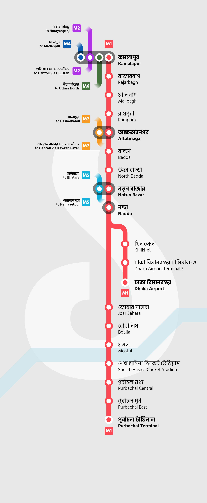
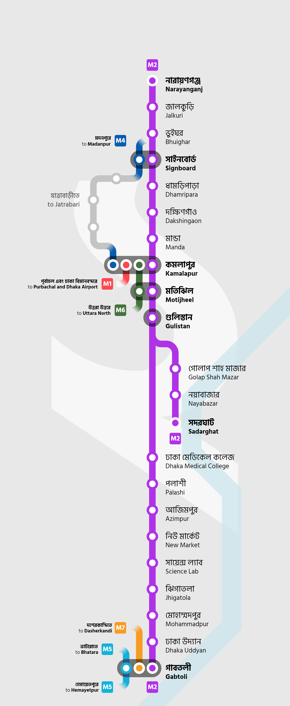
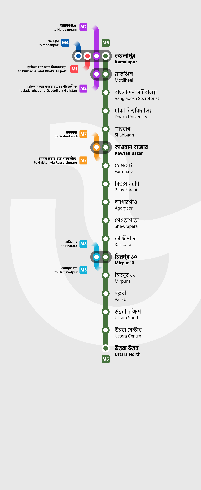
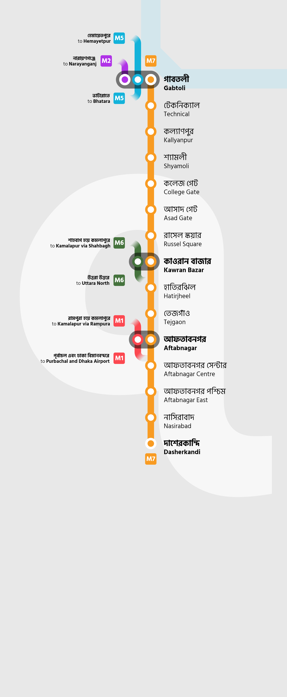

import LicenseCard from "../components/licence-card.astro"

# Concept: Dhaka Metro Rail line maps

Last year, I created and released [an unofficial map](/garden/dhaka-metro-map) for the
Dhaka Metro Rail Network, based on the DMCTL Stage 1 plans. I've now decided to
work on and create route maps for each Metro lines seperately, complete with
bilingual text and interchange information.

<LicenseCard license="cc-by-nc-sa" label="These graphics" labelplural={true} />

    <strong class="bg-[#fd4750] rounded-sm px-1 mr-2.5 flex-shrink" style="color: white !important">M1</strong>
    

        Kamalapur → Dhaka Airport / Purbachal Terminal
        কমলাপুর → ঢাকা বিমানবন্দর / পূর্বাচল টার্মিনাল
    
        

    <strong class="bg-[#af31e7] rounded-sm px-1 mr-2.5 flex-shrink" style="color: white !important">M2</strong>
    

        Narayanganj → Sadarghat / Gabtoli
        নারায়ণগঞ্জ → সদরঘাট / গাবতলী
    
        

    <strong class="bg-[#0a5cad] rounded-sm px-1 mr-2.5 flex-shrink" style="color: white !important">M4</strong>
    

        Kamalapur → Madanpur
        কমলাপুর → মদনপুর
    
        

    <strong class="bg-[#12b1da] rounded-sm px-1 mr-2.5 flex-shrink" style="color: white !important">M5</strong>
    

        Hemayetpur → Bhatara
        হেমায়েতপুর → ভাটারা
    
        

    <strong class="bg-[#45723c] rounded-sm px-1 mr-2.5 flex-shrink" style="color: white !important">M6</strong>
    

        Kamalapur → Uttara North
        কমলাপুর → উত্তরা উত্তর
    
        

    <strong class="bg-[#f79b21] rounded-sm px-1 mr-2.5 flex-shrink" style="color: white !important">M7</strong>
    

        Gabtoli → Dasherkandi
        গাবতলী → দাশেরকান্দি
    
        

