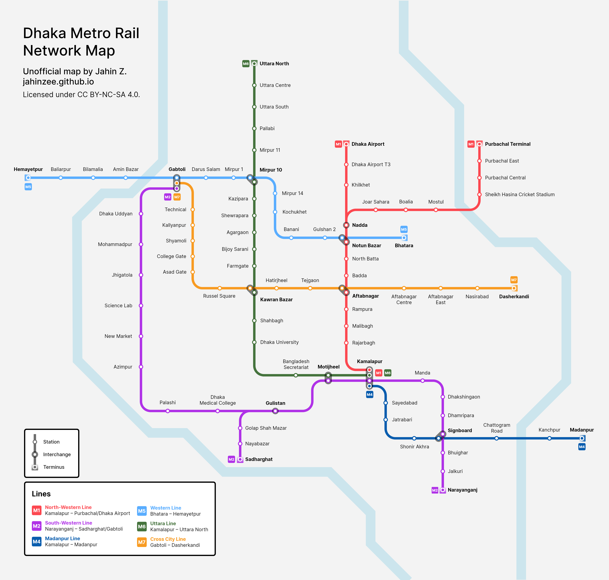

import LicenseCard from "../components/licence-card.astro"

# Concept: Dhaka Metro Rail map

*See also: [Concept: Dhaka Metro Rail line maps](/garden/dhaka-metro-lines).*

In 2022, Dhaka opened its first rapid rail transit line, the [MRT Line 6][][^1] running from Uttara
North to Motijheel. I managed to give it a ride earlier this year when I was visiting family, and I
was very impressed - it was clean and reliable, although the whole
sticking-a-station-above-a-major-road thing was a bit strange to me.

The data for this map was based on the current Phase 1 plans from the [DMCTL website][][^1]. As you
might be able to tell, I also took heavy aesthetic inspiration from the [Sydney Trains/Metro map][].
It was a natural choice of influence, since I am a Sydneysider.

<LicenseCard license="cc-by-nc-sa" label="These graphics" labelplural={true} />

[^1]: This webpage is in Bengali.

[MRT Line 6]: https://dmtcl.gov.bd/site/page/1feee381-0cde-474d-a8f8-11c697814423/-
[DMCTL website]: https://dmtcl.gov.bd/
[Sydney Trains/Metro map]:
    https://transportnsw.info/sites/default/files/document/2023/11/Sydney-rail-network-map.pdf