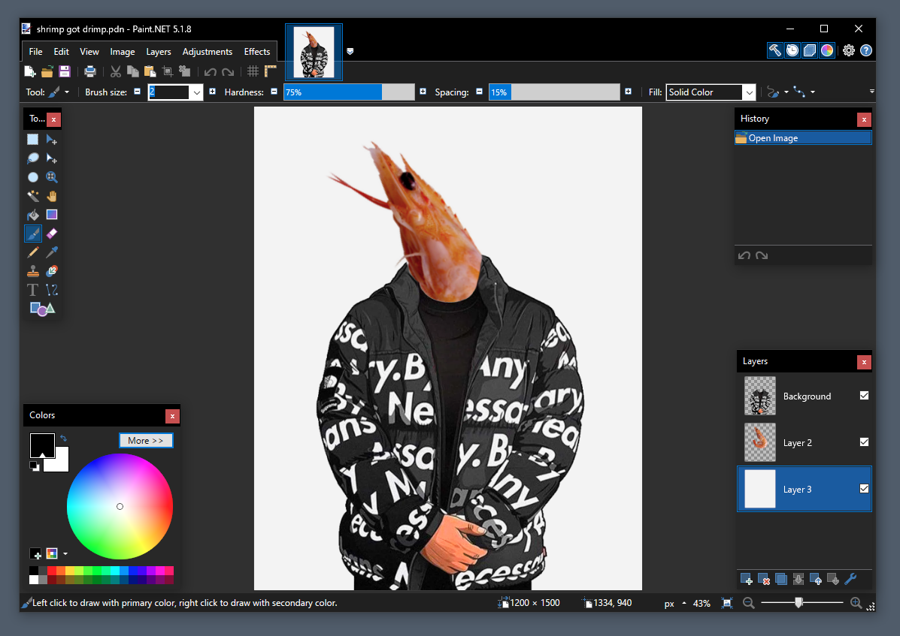
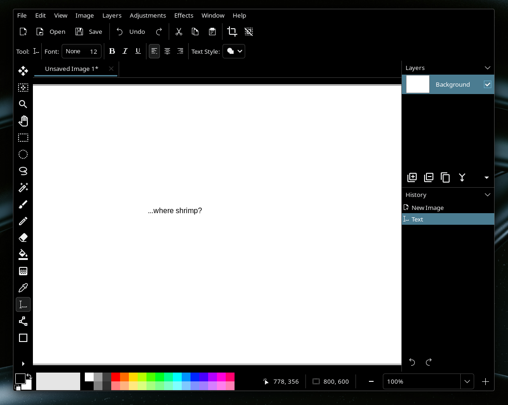
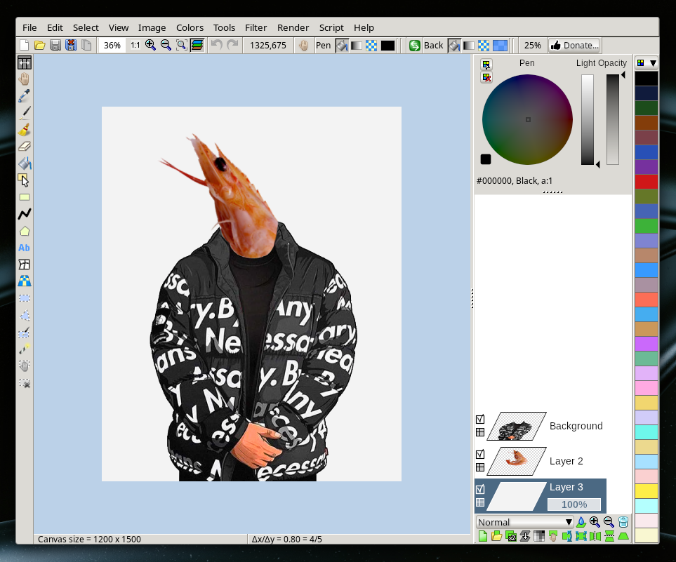
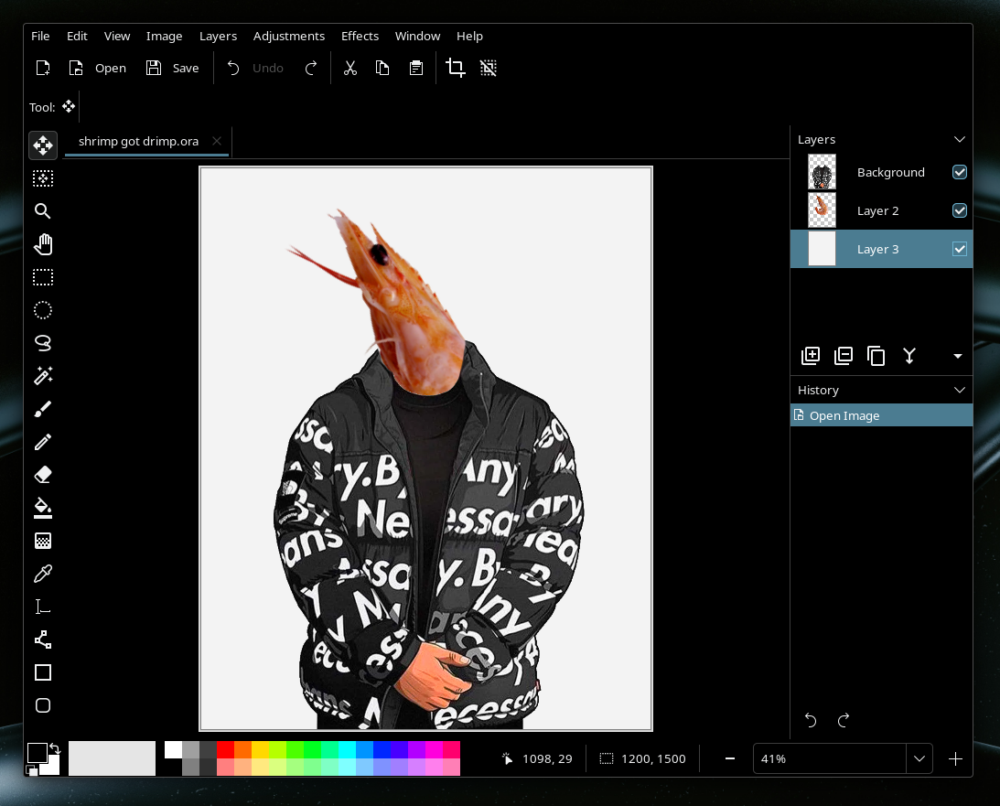
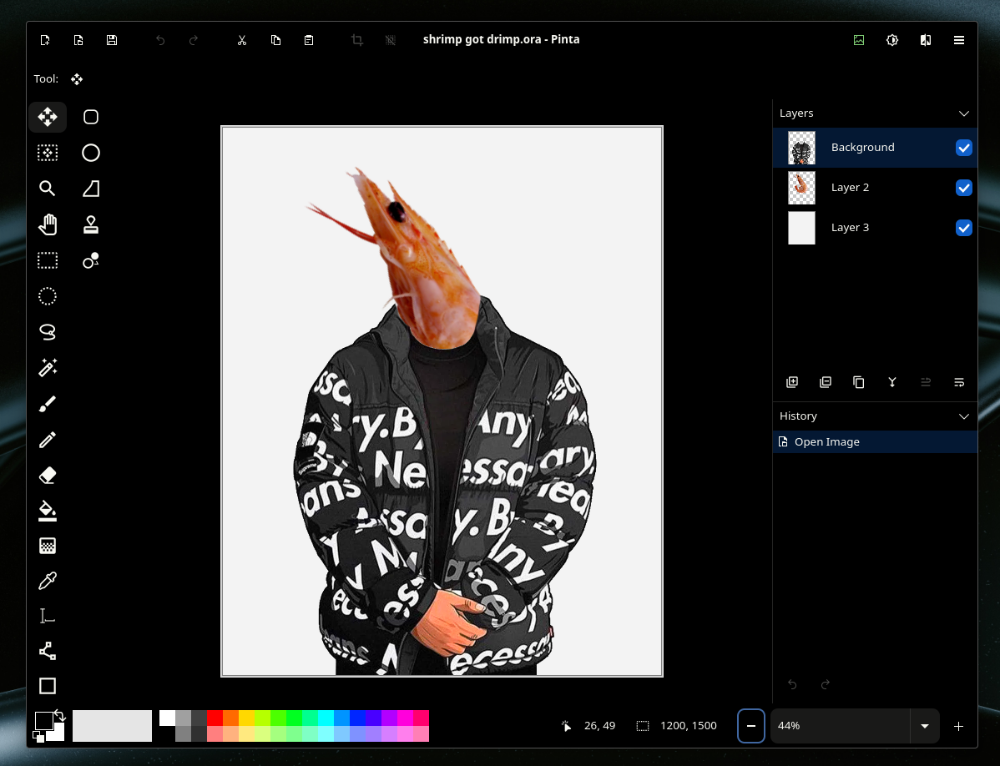
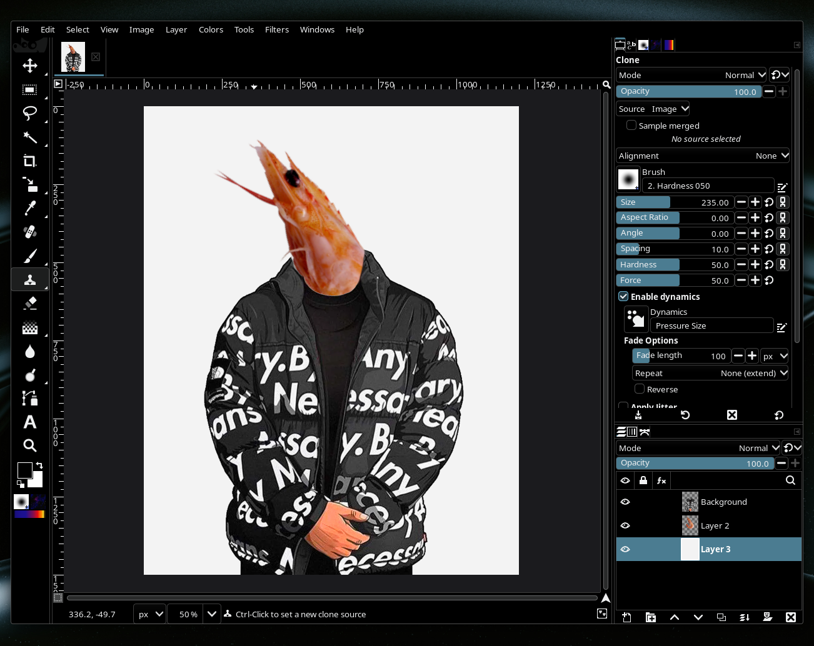

# Digital Dongles, and the art of moving a file across four apps

Ah, the humble file. It's almost always has been a core abstraction around the data we interact with
on personal computers for decades, and still stays strong in a world of data silos and cloud
computing. It's flexible, isolable, and assuming you have a good backup system and prioritise open
formats, timeless.

Here's a story about how I took one file (format), bounced it across four different apps, and why
this is something that I love that I can do with my data.

## Ingredients: a Paint.NET file

Paint.NET is, to this day, my favourite raster drawing program. It's lean and fast, got a nice
repertoire of effects and brushes, layer support, and is very solid. I made a bunch of drawings and
random artwork with it, mainly custom emojis and some random memes.

Back when I was using Windows, it was a staple for me. However, I switched to Linux in 2022, and
modern versions of Paint.NET cannot run under Wine. For a while, my solution to use Paint.NET was to
first dual-boot – later virtualise – a copy of Windows 10 just to run this app.

This was, of course, a cumbersome setup, and it would be very convenient to use something that
integrates better with my Linux environment, be it a native Linux app or even something running
under Wine. So, off I went looking for some alternatives.

For this post, I'll be demonstrating my process with the very first file I tried this with, one that
I call '*shrimp got drimp*' – an old meme edit I made of [Goku Drip](https://knowyourmeme.com/memes/goku-drip)[^1]
and a shrimp:

For my purposes, I needed to convert the file into something that would atleast preserve layer
information, so something like exporting it to a generic image format wasn't gonna cut it.

## Step 1: Searching for a replacement

For my case, it wasn't too hard to find a suitable Linux alternative to Paint.NET, and I found two
primary candidates: GIMP and Pinta.

I wanted something that wasn't super feature rich, just something to make quick edits with filters
and layer support, and ideally something very close to the Paint.NET interface and workflow. Stock
GIMP does a lot more than I need to, while also having – in my opinion – significantly worse UX than
any other image editing app I've used (but we'll come back to GIMP later).

But for now, Pinta it is. When I installed it, it looks rather nice on my KDE Plasma environment,
with well-structured menus and toolbars that are very similar to Paint.NET – totally not
foreshadowing for anything, haha.

Except, now we have another problem, **how do we read Paint.NET files in Pinta?**

## Step 2: Migrating the file formats

Pinta doesn't support Paint.NET files[^2], nor does Paint.NET support the
[OpenRaster format](https://en.wikipedia.org/wiki/OpenRaster) that Pinta uses. In the abstract, this
problem has a very simple solution - find some way to convert one to the other!

For whatever reason at the time, I could hardly find any utility that could convert Paint.NET to
OpenRaster, and the ones I did find seemed to be in various states of abandoned, working on older
versions of the Paint.NET format. Given all of this, I thought I would have to try my hand at reverse
engineering the Paint.NET format – something which I have no experience with.

But eventually, I found something very interesting: [LazPaint](https://lazpaint.github.io/).

It's a very interesting image editing application: it's got a very ancient looking user interface,
it's written in Pascal, and crucially, supports reading Paint.NET files *and* writing to OpenRaster!

From here, all we have to do is load in the original file, click `File › Save as...`, select
OpenRaster from the dropdown, and there we have it, a `.ora` file that can be read by Paint.NET!

And so, I have my original Paint.NET file in an open format, which I can now view with Pinta. Now
time to rinse and repeat for all my other `.pdn` files.

It's worth noting here that since my original search, there appears to now be a lot of options for
modern converters from Paint.NET to OpenRaster. I don't know if they've always been here and I just
couldn't find it back then. If you just want a simple converter without a separate full-blown editor
as a stopgap, Coca162's [PdnBatchConverter](https://github.com/Coca162/PdnBatchConverter) might be
worth looking at, although I haven't tried it.

But in any case, I can now rest easy, and use Paint.NET for all my image editing needs forever
more...

## Step 3: Migrating again

...until an update to Pinta happened, which mainly consisted of two things that I didn't like:

- the adoption of libadwaita, which made the interface look out of place on my Plasma system (this
  is partially mitigated cause I have custom stylesheets), and

- the merging of the toolbar and menubar[^3], which in my opinion is a terrible way to structure a
  multi-functional app, but that's a story for another day.

So once again, it was time to migrate to another app! But.. where to? I didn't really feel like
using LazPaint, and GIMP still has its own issues, or atleast, it did.

With the release of GIMP 3 and the migration to GTK 3, the UI now looks a lot more nicer (and
crucially, I could now use the Breeze theme instead of the default GTK2 skins). It was also around
the same time I discovered [PhotoGIMP](https://github.com/Diolinux/PhotoGIMP), which is a set of
config files and plugins that make GIMP's UX closer to Photoshop. But as someone who's only used
Photoshop very infrequently (and is allergic to SaaS), PhotoGIMP was a lot more approachable to me.
It wasn't quite Paint.NET, but it's much better than stock GIMP.

Now, do I need to convert my files again? Nope! Since I now had the files in an open-source format,
it can now be opened by wider range of applications, including of course, GIMP.

## Serve; add salt to taste

And with that, our story comes to a close. We took one raster image document, converted it to an
open format, and opened it in four different applications.

In a world of proprietary formats and a lot of applications focusing on cloud-first or cloud-only
options, the flexibility of the humble file matters a lot. With files, and especially with open
formats, you don't have to worry about losing your past catalogue of data during a software
migration. And even if you do have to change formats, if the origin format is popular enough,
someone's got you covered with a way to convert to the destination format.

Files, by their very nature, provide the flexibility to use whatever tool you want to read and
manipulate them, which comes in handy if you're switching to or trying out new software, whether it
be for compatibility or just because you don't like the direction some software you're using has
gone.

This extends beyond reading and writing. Files can be literally anywhere: your computer's drive for
offline use (underrated until you find yourself on an airplane), a USB stick, or a cloud service of
*your* choosing, and it's trivial to move between them – no vendor lock-in.

And that's why I love files: they're flexible, platform and service agnostic, and give me control
over my data.

If you haven't already, consider checking out [Local-First software](https://www.inkandswitch.com/essay/local-first/),
and converting your stuff to open formats if you can – be it OpenRaster,
[OpenDocument](https://www.libreoffice.org/discover/what-is-opendocument/), Markdown, Vorbis, or
whatever suits you. It might take some time and a bit of creativity, but it'll be worth it for the
power and freedom you have over your own data. 

[^1]: Yes, I used a Know Your Meme link, deal with it.

[^2]: There was a third-party plugin that let you import Paint.NET files, but it wasn't compatible
      with Pinta 2.0. See [the GitHub discussion about it](https://github.com/PintaProject/Pinta/discussions/827#discussioncomment-9612027).

[^3]: The menu bar and the ability to run w/o the unified header bar did return in
      [a future update](https://github.com/PintaProject/Pinta/issues/781), but by then I'd already
      moved on (womp womp).