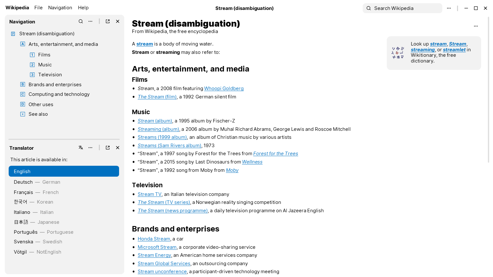
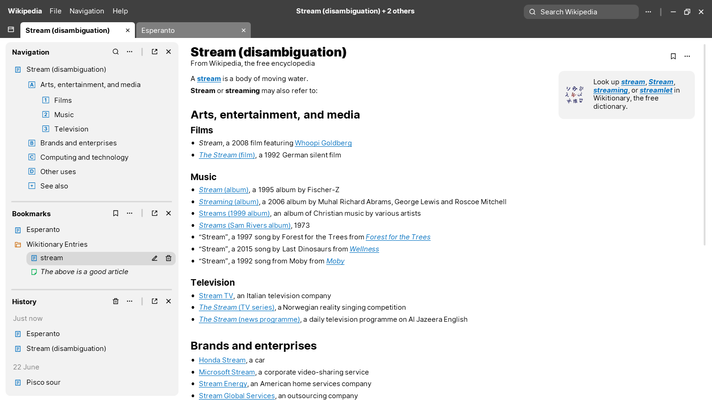

import LicenseCard from "../components/licence-card.astro"

# Concept: Wikipedia desktop app

I made this concept art back for a Wikipedia desktop application back in 2021. Again, dug fresh
out of the archives, and this time with the original source file and hi-res versions available.

<LicenseCard license="cc-by-nc-sa" label="These graphics" labelplural={true} />

Concept 1

Concept 2

