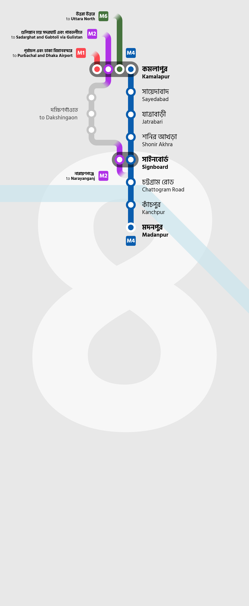
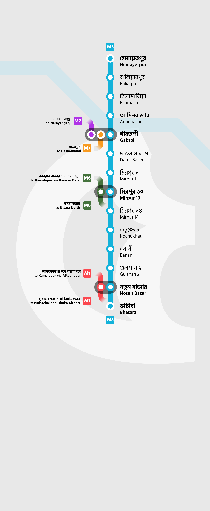

Last year, I created and released [an unofficial map](/graphics/dhaka-metro-map) for the Dhaka Metro Rail Network, based on the DMCTL Stage 1 plans. I’ve now decided to work on and create route maps for each Metro lines seperately, complete with bilingual text and interchange information.

## M1: Kamalapur to Dhaka Airport and Purbachal Terminal

## M2: Narayanganj to Sadarghat and Gabtoli

## M4: Kamalapur to Madanpur

## M5: Hemayetpur to Bhatara

## M6: Kamalapur to Uttara North

## M7: Gabtoli to Dasherkandi

